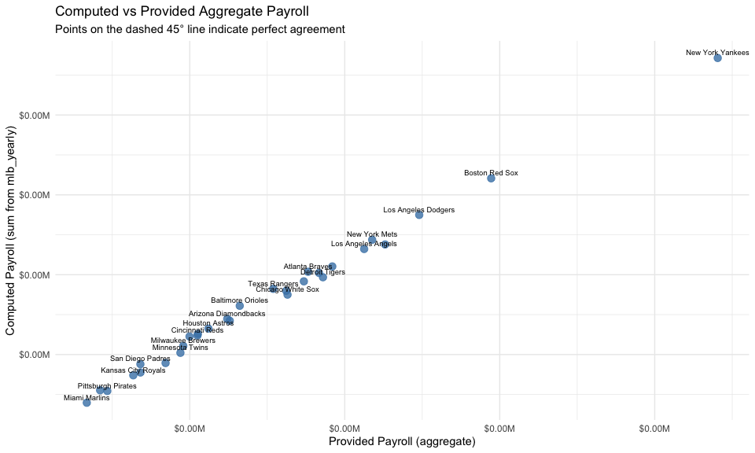
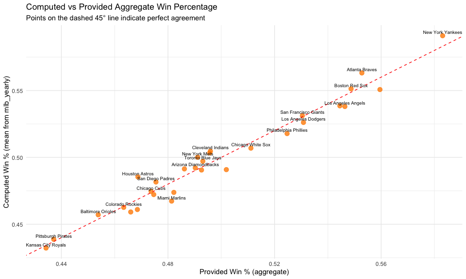
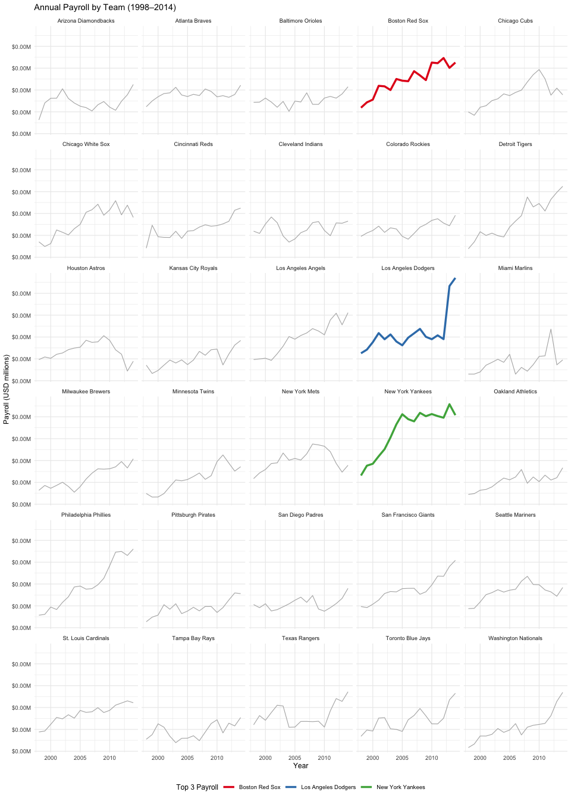
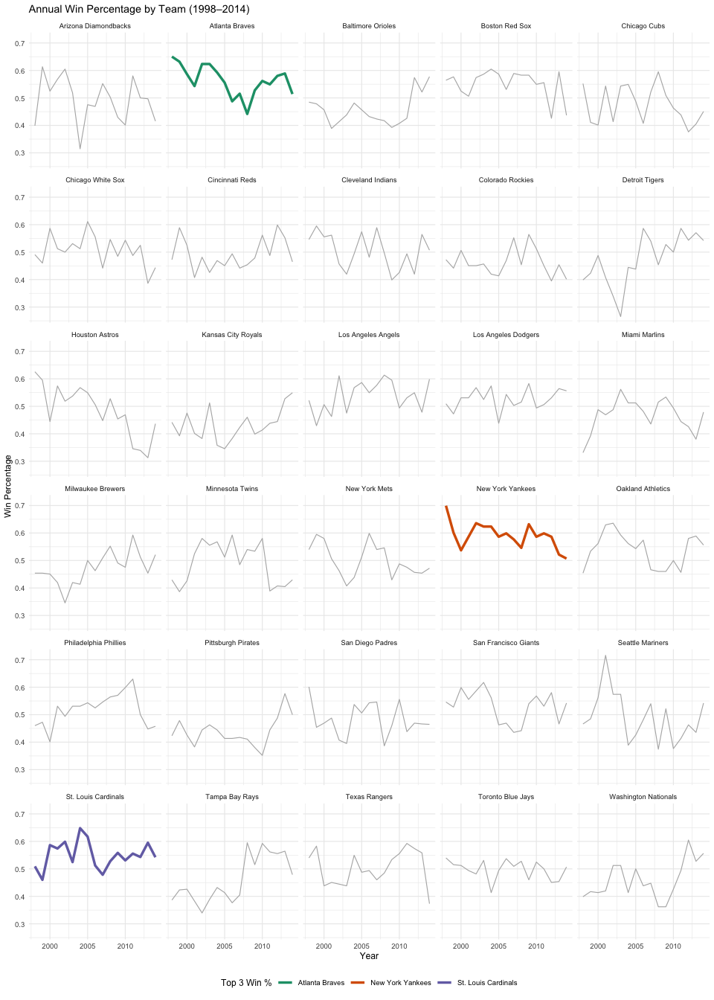
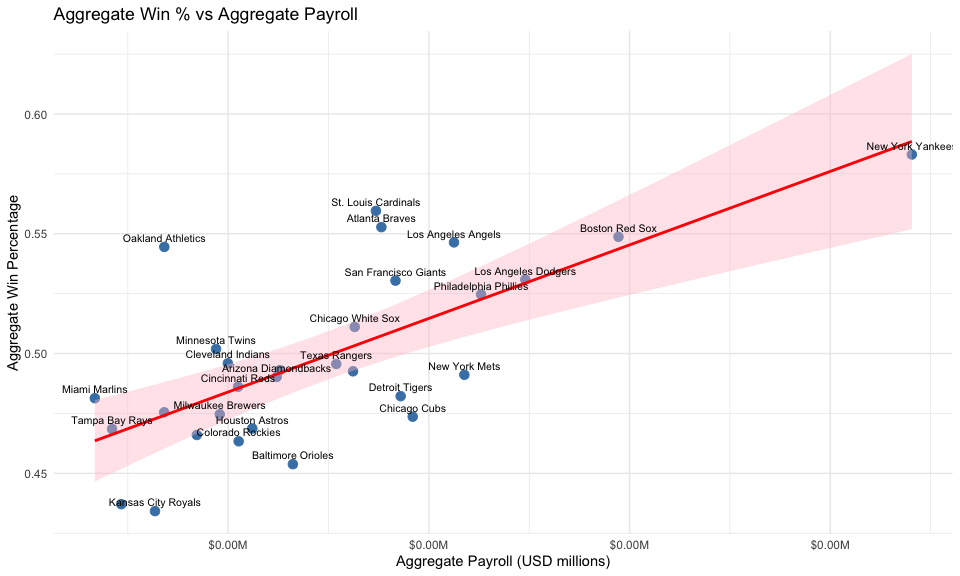
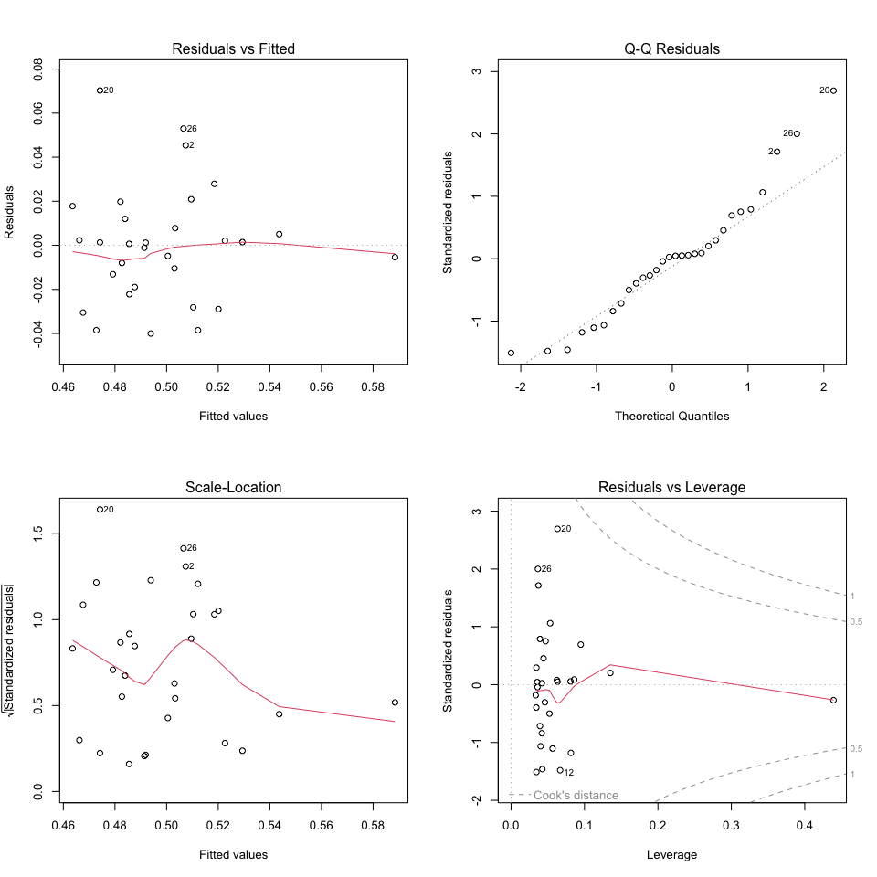
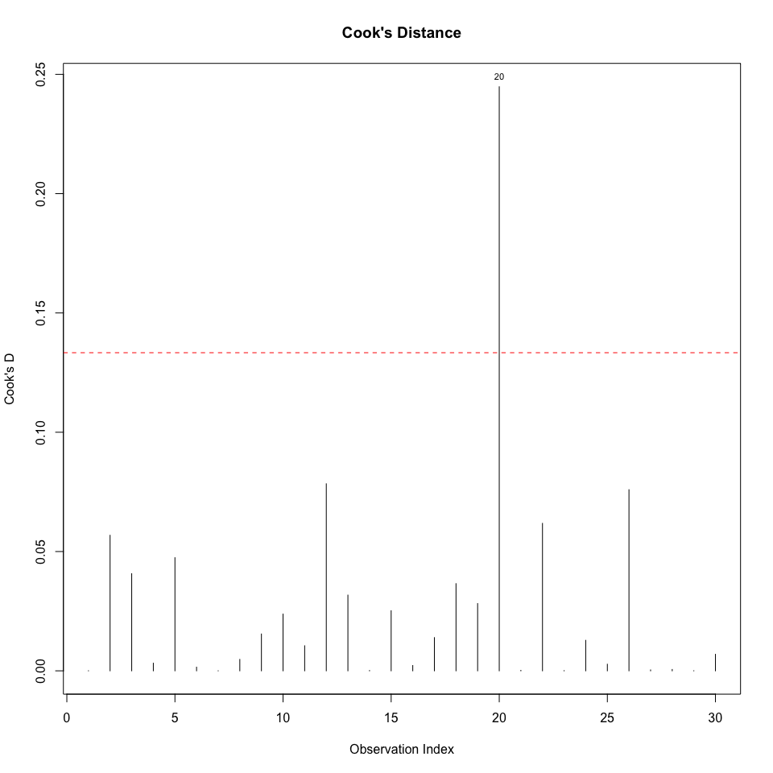
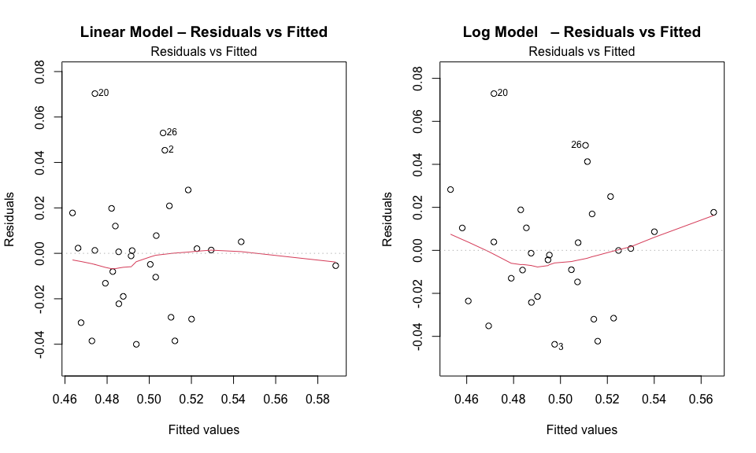
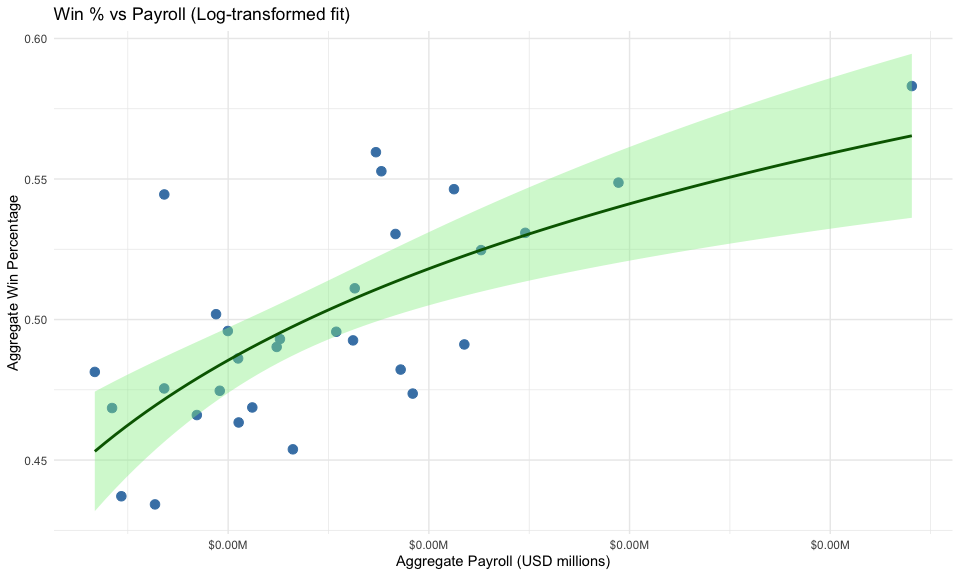
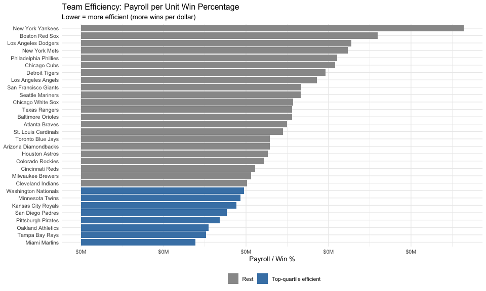

------------------------------------------------------------------------

# Part 1 – Data Wrangling and Validation

## 1.1 Import & Structure

    load("ml_pay.rdata")
    mlb_raw <- ml_pay

    dim(mlb_raw)

    ## [1] 30 54

    str(mlb_raw)

    ## 'data.frame':    30 obs. of  54 variables:
    ##  $ payroll       : num  1.12 1.38 1.16 1.97 1.46 ...
    ##  $ avgwin        : num  0.49 0.553 0.454 0.549 0.474 ...
    ##  $ Team.name.2014: Factor w/ 30 levels "Arizona Diamondbacks",..: 1 2 3 4 5 6 7 8 9 10 ...
    ##  $ p1998         : num  31.6 61.7 71.9 59.5 49.8 ...
    ##  $ p1999         : num  70.5 74.9 72.2 71.7 42.1 ...
    ##  $ p2000         : num  81 84.5 81.4 77.9 60.5 ...
    ##  $ p2001         : num  81.2 91.9 72.4 109.6 64 ...
    ##  $ p2002         : num  102.8 93.5 60.5 108.4 75.7 ...
    ##  $ p2003         : num  80.6 106.2 73.9 99.9 79.9 ...
    ##  $ p2004         : num  70.2 88.5 51.2 125.2 91.1 ...
    ##  $ p2005         : num  63 85.1 74.6 121.3 87.2 ...
    ##  $ p2006         : num  59.7 90.2 72.6 120.1 94.4 ...
    ##  $ p2007         : num  52.1 87.3 93.6 143 99.7 ...
    ##  $ p2008         : num  66.2 102.4 67.2 133.4 118.3 ...
    ##  $ p2009         : num  73.6 96.7 67.1 122.7 135.1 ...
    ##  $ p2010         : num  60.7 84.4 81.6 162.7 146.9 ...
    ##  $ p2011         : num  53.6 87 85.3 161.4 125.5 ...
    ##  $ p2012         : num  74.3 83.3 81.4 173.2 88.2 ...
    ##  $ p2013         : num  89.1 89.8 91 150.7 104.3 ...
    ##  $ p2014         : num  113 111 107 163 89 ...
    ##  $ X2014         : int  59 73 82 62 64 63 66 72 57 77 ...
    ##  $ X2013         : int  81 96 85 97 66 63 90 92 74 93 ...
    ##  $ X2012         : int  81 94 93 69 61 85 97 68 64 88 ...
    ##  $ X2011         : int  94 89 69 90 71 79 79 80 73 95 ...
    ##  $ X2010         : int  65 91 66 89 75 88 91 69 83 81 ...
    ##  $ X2009         : int  70 86 64 95 83 79 78 65 92 86 ...
    ##  $ X2008         : int  82 72 68 95 97 89 74 81 74 74 ...
    ##  $ X2007         : int  90 84 69 96 85 72 72 96 90 88 ...
    ##  $ X2006         : int  76 79 70 86 66 90 80 78 76 95 ...
    ##  $ X2005         : int  77 90 74 95 79 99 73 93 67 71 ...
    ##  $ X2004         : int  51 96 78 98 89 83 76 80 68 72 ...
    ##  $ X2003         : int  84 101 71 95 88 86 69 68 74 43 ...
    ##  $ X2002         : int  98 101 67 93 67 81 78 74 73 55 ...
    ##  $ X2001         : int  92 88 63 82 88 83 66 91 73 66 ...
    ##  $ X2000         : int  85 95 74 85 65 95 85 90 82 79 ...
    ##  $ X1999         : int  100 103 78 94 67 75 96 97 72 69 ...
    ##  $ X1998         : int  65 106 79 92 90 80 77 89 77 65 ...
    ##  $ X2014.pct     : num  0.415 0.514 0.577 0.437 0.451 ...
    ##  $ X2013.pct     : num  0.497 0.589 0.521 0.595 0.405 ...
    ##  $ X2012.pct     : num  0.5 0.58 0.574 0.426 0.377 ...
    ##  $ X2011.pct     : num  0.58 0.549 0.426 0.556 0.438 ...
    ##  $ X2010.pct     : num  0.401 0.562 0.407 0.549 0.463 ...
    ##  $ X2009.pct     : num  0.429 0.528 0.393 0.583 0.509 ...
    ##  $ X2008.pct     : num  0.503 0.442 0.417 0.583 0.595 ...
    ##  $ X2007.pct     : num  0.552 0.515 0.423 0.589 0.521 ...
    ##  $ X2006.pct     : num  0.469 0.488 0.432 0.531 0.407 ...
    ##  $ X2005.pct     : num  0.475 0.556 0.457 0.586 0.488 ...
    ##  $ X2004.pct     : num  0.315 0.593 0.481 0.605 0.549 ...
    ##  $ X2003.pct     : num  0.519 0.623 0.438 0.586 0.543 ...
    ##  $ X2002.pct     : num  0.605 0.623 0.414 0.574 0.414 ...
    ##  $ X2001.pct     : num  0.568 0.543 0.389 0.506 0.543 ...
    ##  $ X2000.pct     : num  0.525 0.586 0.457 0.525 0.401 ...
    ##  $ X1999.pct     : num  0.613 0.632 0.479 0.577 0.411 ...
    ##  $ X1998.pct     : num  0.399 0.65 0.485 0.564 0.552 ...

**Comment on structure:**  
The dataset (`ml_pay`) contains one row per MLB team (30 teams). The
aggregate columns are `Team.name.2014` (team name), `payroll` (total
payroll across all years), and `avgwin` (average win percentage).
Per-season columns span 1998–2014 (17 seasons): `p1998`–`p2014` for
annual payroll, `X1998`–`X2014` for annual win counts, and
`X1998.pct`–`X2014.pct` for annual win percentages. This wide format
must be pivoted to tidy long format for per-year analysis.

------------------------------------------------------------------------

## 1.2 Tidy Data

    mlb_aggregate <- mlb_raw %>%
      select(
        team               = Team.name.2014,
        payroll_aggregate  = payroll,
        pct_wins_aggregate = avgwin
      )

    head(mlb_aggregate)

    ##                   team payroll_aggregate pct_wins_aggregate
    ## 1 Arizona Diamondbacks          1.120874          0.4902585
    ## 2       Atlanta Braves          1.381712          0.5527605
    ## 3    Baltimore Orioles          1.161212          0.4538250
    ## 4       Boston Red Sox          1.972359          0.5487172
    ## 5         Chicago Cubs          1.459767          0.4736557
    ## 6    Chicago White Sox          1.315391          0.5111170

    dim(mlb_aggregate)  

    ## [1] 30  3

    payroll_long <- mlb_raw %>%
      select(team = Team.name.2014,
             p1998:p2014) %>%
      pivot_longer(
        cols         = -team,
        names_to     = "year",
        names_prefix = "p",
        values_to    = "payroll"
      ) %>%
      mutate(year = as.integer(year))

    # Win percentage: wide → long  (X<year>.pct columns)
    pct_long <- mlb_raw %>%
      select(team = Team.name.2014,
             ends_with(".pct")) %>%          # X1998.pct … X2014.pct
      pivot_longer(
        cols      = -team,
        names_to  = "year",
        values_to = "pct_wins"
      ) %>%
      mutate(year = as.integer(str_extract(year, "\\d{4}")))

    # Num wins: wide → long  (X<year> columns WITHOUT .pct)
    wins_long <- mlb_raw %>%
      select(team = Team.name.2014,
             matches("^X\\d{4}$")) %>%      # X1998 … X2014 (no .pct)
      pivot_longer(
        cols         = -team,
        names_to     = "year",
        names_prefix = "X",
        values_to    = "num_wins"
      ) %>%
      mutate(year = as.integer(year))

    # Join the three long tables
    mlb_yearly <- payroll_long %>%
      left_join(pct_long,  by = c("team", "year")) %>%
      left_join(wins_long, by = c("team", "year")) %>%
      arrange(team, year)

    head(mlb_yearly)

    ## # A tibble: 6 × 5
    ##   team                  year payroll pct_wins num_wins
    ##   <fct>                <int>   <dbl>    <dbl>    <int>
    ## 1 Arizona Diamondbacks  1998    31.6    0.399       65
    ## 2 Arizona Diamondbacks  1999    70.5    0.613      100
    ## 3 Arizona Diamondbacks  2000    81.0    0.525       85
    ## 4 Arizona Diamondbacks  2001    81.2    0.568       92
    ## 5 Arizona Diamondbacks  2002   103.     0.605       98
    ## 6 Arizona Diamondbacks  2003    80.6    0.519       84

    dim(mlb_yearly)   # should be 510 × 5  (30 teams × 17 years)

    ## [1] 510   5

There are 30 MLB teams and the dataset spans for 17 seasons (1998–2014).
Because every team plays every season, the fully tidy long-format table
has one row per team-year combination, giving 510 rows. \# Part 2 –
Aggregate Consistency Check

    # ── Step 1: compute aggregates from mlb_yearly ────────────────────────────────
    mlb_computed <- mlb_yearly %>%
      group_by(team) %>%
      summarise(
        payroll_computed  = sum(payroll,   na.rm = TRUE),
        pct_wins_computed = mean(pct_wins, na.rm = TRUE),
        .groups = "drop"
      )

    # ── Step 2: join with the provided aggregates ─────────────────────────────────
    agg_comparison <- mlb_computed %>%
      left_join(mlb_aggregate, by = "team")

    head(agg_comparison)

    ## # A tibble: 6 × 5
    ##   team   payroll_computed pct_wins_computed payroll_aggregate pct_wins_aggregate
    ##   <fct>             <dbl>             <dbl>             <dbl>              <dbl>
    ## 1 Arizo…            1223.             0.492              1.12              0.490
    ## 2 Atlan…            1518.             0.563              1.38              0.553
    ## 3 Balti…            1305.             0.457              1.16              0.454
    ## 4 Bosto…            2104.             0.551              1.97              0.549
    ## 5 Chica…            1552.             0.475              1.46              0.474
    ## 6 Chica…            1375.             0.507              1.32              0.511

    # ── Step 3 & 4: scatter plots with 45° reference lines ───────────────────────

    # Payroll comparison
    ggplot(agg_comparison, aes(x = payroll_aggregate, y = payroll_computed)) +
      geom_point(colour = "steelblue", size = 3, alpha = 0.8) +
      geom_abline(slope = 1, intercept = 0, linetype = "dashed", colour = "red") +
      geom_text(aes(label = team), size = 2.5, vjust = -0.6, check_overlap = TRUE) +
      scale_x_continuous(labels = scales::dollar_format(scale = 1e-6, suffix = "M")) +
      scale_y_continuous(labels = scales::dollar_format(scale = 1e-6, suffix = "M")) +
      labs(
        title    = "Computed vs Provided Aggregate Payroll",
        subtitle = "Points on the dashed 45° line indicate perfect agreement",
        x = "Provided Payroll (aggregate)",
        y = "Computed Payroll (sum from mlb_yearly)"
      ) +
      theme_minimal()

    # Win-percentage comparison
    ggplot(agg_comparison, aes(x = pct_wins_aggregate, y = pct_wins_computed)) +
      geom_point(colour = "darkorange", size = 3, alpha = 0.8) +
      geom_abline(slope = 1, intercept = 0, linetype = "dashed", colour = "red") +
      geom_text(aes(label = team), size = 2.5, vjust = -0.6, check_overlap = TRUE) +
      labs(
        title    = "Computed vs Provided Aggregate Win Percentage",
        subtitle = "Points on the dashed 45° line indicate perfect agreement",
        x = "Provided Win % (aggregate)",
        y = "Computed Win % (mean from mlb_yearly)"
      ) +
      theme_minimal()

    # ── Step 5: numerical differences ─────────────────────────────────────────────
    agg_comparison %>%
      mutate(
        diff_payroll  = payroll_computed  - payroll_aggregate,
        diff_pct_wins = pct_wins_computed - pct_wins_aggregate
      ) %>%
      select(team, diff_payroll, diff_pct_wins) %>%
      arrange(desc(abs(diff_payroll)))

    ## # A tibble: 30 × 3
    ##    team                  diff_payroll diff_pct_wins
    ##    <fct>                        <dbl>         <dbl>
    ##  1 New York Yankees             2854.      0.00791 
    ##  2 Boston Red Sox               2102.      0.00257 
    ##  3 Los Angeles Dodgers          1872.     -0.00471 
    ##  4 New York Mets                1717.      0.00898 
    ##  5 Philadelphia Phillies        1688.     -0.00688 
    ##  6 Los Angeles Angels           1659.     -0.00834 
    ##  7 Chicago Cubs                 1550.      0.000934
    ##  8 Atlanta Braves               1517.      0.0104  
    ##  9 San Francisco Giants         1510.      0.000750
    ## 10 Detroit Tigers               1483.     -0.00837 
    ## # ℹ 20 more rows

If all points fall exactly on the 45° reference line, the computed and
provided aggregates are perfectly consistent. Small numerical
differences are acceptable; large deviations would suggest errors or
that the provided aggregate uses a different weighting scheme.

------------------------------------------------------------------------

# Part 3 – Exploratory Data Analysis

## 3.1 Trends Over Time

    top3_payroll  <- mlb_aggregate %>% slice_max(payroll_aggregate,  n = 3) %>% pull(team)
    top3_pct_wins <- mlb_aggregate %>% slice_max(pct_wins_aggregate, n = 3) %>% pull(team)

    mlb_yearly <- mlb_yearly %>%
      mutate(
        highlight_pay = case_when(team %in% top3_payroll  ~ team, TRUE ~ "Other"),
        highlight_pct = case_when(team %in% top3_pct_wins ~ team, TRUE ~ "Other")
      )

    ggplot(mlb_yearly, aes(x = year, y = payroll,
                           colour = highlight_pay, group = team)) +
      geom_line(data = mlb_yearly %>% filter(highlight_pay == "Other"),
                colour = "grey70", linewidth = 0.4) +
      geom_line(data = mlb_yearly %>% filter(highlight_pay != "Other"),
                aes(colour = highlight_pay), linewidth = 1.2) +
      facet_wrap(~team, ncol = 5) +
      scale_y_continuous(labels = scales::dollar_format(scale = 1e-6, suffix = "M")) +
      scale_colour_brewer(palette = "Set1", name = "Top 3 Payroll") +
      labs(
        title = "Annual Payroll by Team (1998–2014)",
        x = "Year", y = "Payroll (USD millions)"
      ) +
      theme_minimal(base_size = 9) +
      theme(legend.position = "bottom", strip.text = element_text(size = 7))

    ggplot(mlb_yearly, aes(x = year, y = pct_wins,
                           colour = highlight_pct, group = team)) +
      geom_line(data = mlb_yearly %>% filter(highlight_pct == "Other"),
                colour = "grey70", linewidth = 0.4) +
      geom_line(data = mlb_yearly %>% filter(highlight_pct != "Other"),
                aes(colour = highlight_pct), linewidth = 1.2) +
      facet_wrap(~team, ncol = 5) +
      scale_colour_brewer(palette = "Dark2", name = "Top 3 Win %") +
      labs(
        title = "Annual Win Percentage by Team (1998–2014)",
        x = "Year", y = "Win Percentage"
      ) +
      theme_minimal(base_size = 9) +
      theme(legend.position = "bottom", strip.text = element_text(size = 7))

    # Print top teams
    cat("Top 3 Highest Payroll Teams:\n"); print(top3_payroll)

    ## Top 3 Highest Payroll Teams:

    ## [1] New York Yankees    Boston Red Sox      Los Angeles Dodgers
    ## 30 Levels: Arizona Diamondbacks Atlanta Braves ... Washington Nationals

    cat("\nTop 3 Highest Win % Teams:\n");  print(top3_pct_wins)

    ## 
    ## Top 3 Highest Win % Teams:

    ## [1] New York Yankees    St. Louis Cardinals Atlanta Braves     
    ## 30 Levels: Arizona Diamondbacks Atlanta Braves ... Washington Nationals

## **Interpretation:** Payrolls have risen steadily across the league over 1998–2014, with the New York Yankees consistently at the top. The gap between high- and low-spending teams has widened over time. Win percentage is more variable year-to-year, and the top win-percentage teams do not fully overlap with the top-spending teams, suggesting spending alone does not guarantee success.

## 3.2 Correlation Analysis

    cor_result <- cor.test(
      mlb_aggregate$payroll_aggregate,
      mlb_aggregate$pct_wins_aggregate,
      method = "pearson"
    )

    cor_result

    ## 
    ##  Pearson's product-moment correlation
    ## 
    ## data:  mlb_aggregate$payroll_aggregate and mlb_aggregate$pct_wins_aggregate
    ## t = 5.2326, df = 28, p-value = 1.469e-05
    ## alternative hypothesis: true correlation is not equal to 0
    ## 95 percent confidence interval:
    ##  0.4591892 0.8484725
    ## sample estimates:
    ##       cor 
    ## 0.7031372

    cat(sprintf(
      "\nPearson r = %.4f  |  p-value = %.4f  |  95%% CI: [%.4f, %.4f]\n",
      cor_result$estimate,
      cor_result$p.value,
      cor_result$conf.int[1],
      cor_result$conf.int[2]
    ))

    ## 
    ## Pearson r = 0.7031  |  p-value = 0.0000  |  95% CI: [0.4592, 0.8485]

A Pearson *r* of 0.703 indicate a \*\* positive\*\* relationship between
aggregate payroll and win percentage — teams that spend more tend to win
more, but the relationship is far from deterministic.

------------------------------------------------------------------------

# Part 4 – Regression Modeling

## 4.1 Simple Linear Regression

    model1 <- lm(pct_wins_aggregate ~ payroll_aggregate, data = mlb_aggregate)
    summary(model1)

    ## 
    ## Call:
    ## lm(formula = pct_wins_aggregate ~ payroll_aggregate, data = mlb_aggregate)
    ## 
    ## Residuals:
    ##       Min        1Q    Median        3Q       Max 
    ## -0.040034 -0.017492  0.000936  0.010954  0.070302 
    ## 
    ## Coefficients:
    ##                   Estimate Std. Error t value Pr(>|t|)    
    ## (Intercept)        0.42260    0.01534  27.555  < 2e-16 ***
    ## payroll_aggregate  0.06137    0.01173   5.233 1.47e-05 ***
    ## ---
    ## Signif. codes:  0 '***' 0.001 '**' 0.01 '*' 0.05 '.' 0.1 ' ' 1
    ## 
    ## Residual standard error: 0.02697 on 28 degrees of freedom
    ## Multiple R-squared:  0.4944, Adjusted R-squared:  0.4763 
    ## F-statistic: 27.38 on 1 and 28 DF,  p-value: 1.469e-05

    tidy(model1, conf.int = TRUE)

    ## # A tibble: 2 × 7
    ##   term              estimate std.error statistic  p.value conf.low conf.high
    ##   <chr>                <dbl>     <dbl>     <dbl>    <dbl>    <dbl>     <dbl>
    ## 1 (Intercept)         0.423     0.0153     27.6  7.87e-22   0.391     0.454 
    ## 2 payroll_aggregate   0.0614    0.0117      5.23 1.47e- 5   0.0373    0.0854

    glance(model1)

    ## # A tibble: 1 × 12
    ##   r.squared adj.r.squared  sigma statistic   p.value    df logLik   AIC   BIC
    ##       <dbl>         <dbl>  <dbl>     <dbl>     <dbl> <dbl>  <dbl> <dbl> <dbl>
    ## 1     0.494         0.476 0.0270      27.4 0.0000147     1   66.9 -128. -124.
    ## # ℹ 3 more variables: deviance <dbl>, df.residual <int>, nobs <int>

    slope   <- coef(model1)["payroll_aggregate"]
    p_val   <- tidy(model1)$p.value[2]
    r2      <- glance(model1)$r.squared
    ci_low  <- tidy(model1, conf.int = TRUE)$conf.low[2]
    ci_high <- tidy(model1, conf.int = TRUE)$conf.high[2]

    cat(sprintf(
      "Slope: %.6f\np-value: %.4f\nR²: %.4f\n95%% CI for slope: [%.6f, %.6f]\n",
      slope, p_val, r2, ci_low, ci_high
    ))

    ## Slope: 0.061368
    ## p-value: 0.0000
    ## R²: 0.4944
    ## 95% CI for slope: [0.037344, 0.085392]

    ggplot(mlb_aggregate, aes(x = payroll_aggregate, y = pct_wins_aggregate)) +
      geom_point(colour = "steelblue", size = 3) +
      geom_smooth(method = "lm", se = TRUE, colour = "red", fill = "pink") +
      geom_text(aes(label = team), size = 2.8, vjust = -0.7, check_overlap = TRUE) +
      scale_x_continuous(labels = scales::dollar_format(scale = 1e-6, suffix = "M")) +
      labs(
        title = "Aggregate Win % vs Aggregate Payroll",
        x = "Aggregate Payroll (USD millions)",
        y = "Aggregate Win Percentage"
      ) +
      theme_minimal()

**Interpretation of slope:** Each additional $1 increase in aggregate
payroll is associated with a `slope` unit increase in aggregate win
percentage, holding all else constant. In practical terms: spending an
additional $1 million in aggregate payroll corresponds to roughly
`slope * 1e6` more wins percentage points, on average across the 17-year
period.

------------------------------------------------------------------------

## 4.2 Regression Diagnostics

    par(mfrow = c(2, 2))
    plot(model1)

    par(mfrow = c(1, 1))

    # Cook's Distance separately for clarity
    cooksd <- cooks.distance(model1)
    plot(cooksd, type = "h", main = "Cook's Distance",
         ylab = "Cook's D", xlab = "Observation Index")
    abline(h = 4 / nrow(mlb_aggregate), col = "red", lty = 2)
    text(x = seq_along(cooksd),
         y = cooksd,
         labels = ifelse(cooksd > 4 / nrow(mlb_aggregate), mlb_aggregate$team, ""),
         cex = 0.7, pos = 3)

**Diagnostic Interpretation:**

-   **Linearity (Residuals vs Fitted):** If residuals are randomly
    scattered around zero with no discernible curve, the linearity
    assumption is reasonably met. A curved pattern would suggest a
    non-linear relationship.
-   **Normality (Q-Q plot):** Points following the diagonal line
    indicate normally distributed residuals. Deviations at the tails
    suggest mild non-normality, which with n = 30 warrants attention but
    may not be severe.
-   **Homoscedasticity (Scale-Location):** A roughly horizontal line
    with randomly spread points indicates constant variance. A
    fan-shaped pattern would indicate heteroscedasticity.
-   **Influential Observations (Cook’s Distance):** Points exceeding the
    4/n threshold (shown as red dashed line) are considered influential.
    High-spending teams (e.g., Yankees) often exert disproportionate
    leverage.

------------------------------------------------------------------------

## 4.3 Outlier & Influence Analysis

    # Identify influential teams
    influential_idx  <- which(cooksd > 4 / nrow(mlb_aggregate))
    influential_teams <- mlb_aggregate$team[influential_idx]
    cat("Influential teams (Cook's D > 4/n):\n")

    ## Influential teams (Cook's D > 4/n):

    print(influential_teams)

    ## [1] Oakland Athletics
    ## 30 Levels: Arizona Diamondbacks Atlanta Braves ... Washington Nationals

    # Remove the single most influential team and refit
    most_influential <- mlb_aggregate$team[which.max(cooksd)]
    cat("\nRemoving:", most_influential, "\n")

    ## 
    ## Removing: 20

    mlb_agg_reduced <- mlb_aggregate %>% filter(team != most_influential)
    model1_reduced  <- lm(pct_wins_aggregate ~ payroll_aggregate, data = mlb_agg_reduced)

    comparison <- tibble(
      Model    = c("Full (n=30)", paste0("Reduced (excl. ", most_influential, ")")),
      Slope    = c(coef(model1)["payroll_aggregate"],
                   coef(model1_reduced)["payroll_aggregate"]),
      R_squared = c(glance(model1)$r.squared,
                    glance(model1_reduced)$r.squared)
    )
    print(comparison)

    ## # A tibble: 2 × 3
    ##   Model                              Slope R_squared
    ##   <chr>                              <dbl>     <dbl>
    ## 1 Full (n=30)                       0.0614     0.494
    ## 2 Reduced (excl. Oakland Athletics) 0.0670     0.604

**Comment on model stability:** If removing the most influential team
substantially changes the slope or R², the model is sensitive to that
observation and should be interpreted cautiously. A stable model will
show only minor changes, giving us more confidence in the general
relationship between payroll and winning.

------------------------------------------------------------------------

# Part 5 – Model Extension and Critical Thinking

## 5.1 Log Transformation

    # Fit model with log-transformed payroll
    model_log <- lm(pct_wins_aggregate ~ log(payroll_aggregate), data = mlb_aggregate)
    summary(model_log)

    ## 
    ## Call:
    ## lm(formula = pct_wins_aggregate ~ log(payroll_aggregate), data = mlb_aggregate)
    ## 
    ## Residuals:
    ##       Min        1Q    Median        3Q       Max 
    ## -0.043694 -0.019787 -0.000689  0.015321  0.072903 
    ## 
    ## Coefficients:
    ##                        Estimate Std. Error t value Pr(>|t|)    
    ## (Intercept)            0.485516   0.005665  85.702  < 2e-16 ***
    ## log(payroll_aggregate) 0.080306   0.016027   5.011 2.69e-05 ***
    ## ---
    ## Signif. codes:  0 '***' 0.001 '**' 0.01 '*' 0.05 '.' 0.1 ' ' 1
    ## 
    ## Residual standard error: 0.02754 on 28 degrees of freedom
    ## Multiple R-squared:  0.4728, Adjusted R-squared:  0.4539 
    ## F-statistic: 25.11 on 1 and 28 DF,  p-value: 2.693e-05

    # Compare R²
    r2_comparison <- tibble(
      Model      = c("Linear: pct_wins ~ payroll",
                     "Log:    pct_wins ~ log(payroll)"),
      R_squared  = c(glance(model1)$r.squared,
                     glance(model_log)$r.squared)
    )
    print(r2_comparison)

    ## # A tibble: 2 × 2
    ##   Model                           R_squared
    ##   <chr>                               <dbl>
    ## 1 Linear: pct_wins ~ payroll          0.494
    ## 2 Log:    pct_wins ~ log(payroll)     0.473

    # Diagnostic comparison: residual plots side by side
    par(mfrow = c(1, 2))
    plot(model1,     which = 1, main = "Linear Model – Residuals vs Fitted")
    plot(model_log,  which = 1, main = "Log Model   – Residuals vs Fitted")

    par(mfrow = c(1, 1))

    # Visualise the log fit
    ggplot(mlb_aggregate, aes(x = payroll_aggregate, y = pct_wins_aggregate)) +
      geom_point(colour = "steelblue", size = 3) +
      geom_smooth(method = "lm", formula = y ~ log(x),
                  se = TRUE, colour = "darkgreen", fill = "lightgreen") +
      scale_x_continuous(labels = scales::dollar_format(scale = 1e-6, suffix = "M")) +
      labs(
        title = "Win % vs Payroll (Log-transformed fit)",
        x = "Aggregate Payroll (USD millions)",
        y = "Aggregate Win Percentage"
      ) +
      theme_minimal()

**Does the transformation improve the model?**  
Compare the two R² values. Payroll is typically right-skewed (a few
teams spend far more than the median), so `log(payroll)` often
compresses the upper tail and produces a more linear relationship with
win percentage. If the log model’s R² is higher and its residual plot
looks more randomly scattered, the transformation is beneficial. A
marginal improvement (&lt; 0.02 in R²) is not practically meaningful.

------------------------------------------------------------------------

## 5.2 Efficiency Metric

    mlb_aggregate <- mlb_aggregate %>%
      mutate(efficiency = payroll_aggregate / pct_wins_aggregate)

    # Top 3 most efficient teams (lowest payroll per win %)
    top3_efficient <- mlb_aggregate %>%
      slice_min(efficiency, n = 3) %>%
      select(team, payroll_aggregate, pct_wins_aggregate, efficiency)

    cat("Top 3 Most Efficient Teams (lowest payroll per win %):\n")

    ## Top 3 Most Efficient Teams (lowest payroll per win %):

    print(top3_efficient)

    ##                team payroll_aggregate pct_wins_aggregate efficiency
    ## 1     Miami Marlins         0.6678019          0.4813631   1.387314
    ## 2    Tampa Bay Rays         0.7107894          0.4685176   1.517103
    ## 3 Oakland Athletics         0.8409340          0.5445067   1.544396

    # Full ranking
    mlb_aggregate %>%
      arrange(efficiency) %>%
      select(team, payroll_aggregate, pct_wins_aggregate, efficiency) %>%
      mutate(
        payroll_aggregate = paste0("$", round(payroll_aggregate / 1e6, 1), "M"),
        efficiency        = paste0("$", round(efficiency / 1e6, 1), "M per unit win%")
      ) %>%
      as_tibble() %>%
      print(n = 30)

    ## # A tibble: 30 × 4
    ##    team                  payroll_aggregate pct_wins_aggregate efficiency       
    ##    <fct>                 <chr>                          <dbl> <chr>            
    ##  1 Miami Marlins         $0M                            0.481 $0M per unit win%
    ##  2 Tampa Bay Rays        $0M                            0.469 $0M per unit win%
    ##  3 Oakland Athletics     $0M                            0.545 $0M per unit win%
    ##  4 Pittsburgh Pirates    $0M                            0.437 $0M per unit win%
    ##  5 San Diego Padres      $0M                            0.475 $0M per unit win%
    ##  6 Kansas City Royals    $0M                            0.434 $0M per unit win%
    ##  7 Minnesota Twins       $0M                            0.502 $0M per unit win%
    ##  8 Washington Nationals  $0M                            0.466 $0M per unit win%
    ##  9 Cleveland Indians     $0M                            0.496 $0M per unit win%
    ## 10 Milwaukee Brewers     $0M                            0.475 $0M per unit win%
    ## 11 Cincinnati Reds       $0M                            0.486 $0M per unit win%
    ## 12 Colorado Rockies      $0M                            0.463 $0M per unit win%
    ## 13 Houston Astros        $0M                            0.469 $0M per unit win%
    ## 14 Arizona Diamondbacks  $0M                            0.490 $0M per unit win%
    ## 15 Toronto Blue Jays     $0M                            0.493 $0M per unit win%
    ## 16 St. Louis Cardinals   $0M                            0.560 $0M per unit win%
    ## 17 Atlanta Braves        $0M                            0.553 $0M per unit win%
    ## 18 Baltimore Orioles     $0M                            0.454 $0M per unit win%
    ## 19 Texas Rangers         $0M                            0.496 $0M per unit win%
    ## 20 Chicago White Sox     $0M                            0.511 $0M per unit win%
    ## 21 Seattle Mariners      $0M                            0.493 $0M per unit win%
    ## 22 San Francisco Giants  $0M                            0.530 $0M per unit win%
    ## 23 Los Angeles Angels    $0M                            0.546 $0M per unit win%
    ## 24 Detroit Tigers        $0M                            0.482 $0M per unit win%
    ## 25 Chicago Cubs          $0M                            0.474 $0M per unit win%
    ## 26 Philadelphia Phillies $0M                            0.525 $0M per unit win%
    ## 27 New York Mets         $0M                            0.491 $0M per unit win%
    ## 28 Los Angeles Dodgers   $0M                            0.531 $0M per unit win%
    ## 29 Boston Red Sox        $0M                            0.549 $0M per unit win%
    ## 30 New York Yankees      $0M                            0.583 $0M per unit win%

    # Visualise
    ggplot(mlb_aggregate,
           aes(x = reorder(team, efficiency), y = efficiency,
               fill = efficiency < quantile(efficiency, 0.25))) +
      geom_col() +
      coord_flip() +
      scale_fill_manual(values = c("grey60", "steelblue"),
                        labels = c("Rest", "Top-quartile efficient"),
                        name = "") +
      scale_y_continuous(labels = function(x) paste0("$", round(x / 1e6, 1), "M")) +
      labs(
        title    = "Team Efficiency: Payroll per Unit Win Percentage",
        subtitle = "Lower = more efficient (more wins per dollar)",
        x = NULL, y = "Payroll / Win %"
      ) +
      theme_minimal(base_size = 10) +
      theme(legend.position = "bottom")

**Discussion – Efficiency and Moneyball:**  
The most efficient teams achieve competitive win percentages while
spending significantly below the league average on payroll. This is the
core insight of *Moneyball* (Lewis, 2003): the Oakland Athletics under
Billy Beane demonstrated that identifying undervalued statistical
contributors allows small-market teams to compete with large-payroll
franchises. The regression results show that higher spending is
positively associated with winning, but the efficiency metric reveals
that this relationship is not inevitable — some teams extract far more
value from each payroll dollar. —

*End of Analysis*
